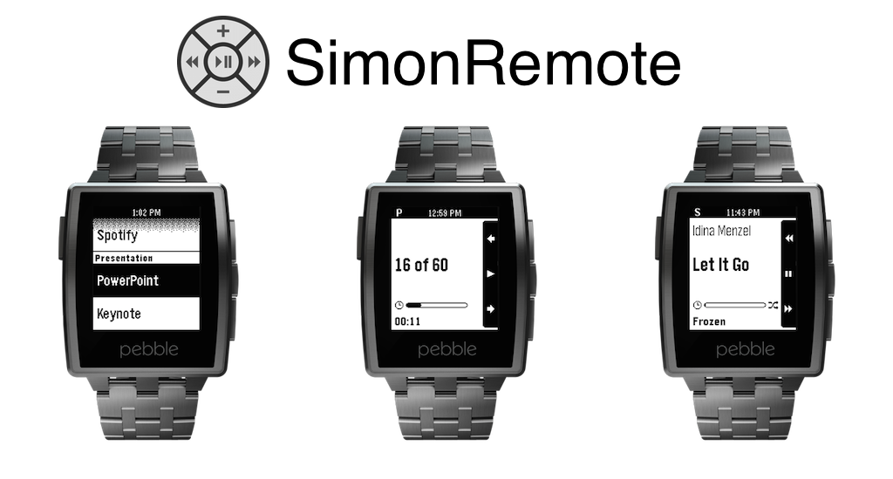

[gimmick:theme](yeti)
 

# Control a Mac's presentation and music software with a Pebble

# Overview
SimonRemote is a solution that uses a Pebble to control a user's Mac computer. It currently allows the control of music players and presentation software, but more features are soon to be added. 

> SimonRemote requires a Mac companion app to be installed on the computer to be controlled. 

# 3 Simple Instructions
1. Download the [Mac application](mac.md) and the [Pebble application](pebble.md).
2. Run the Mac application, click the menu-bar icon, and record the 8 character channel.
3. Run the Pebble application and enter the channel into the settings page.
4. That's it! Start controlling!

# Features

## Pebble Application

### PowerPoint and Keynote
- Show next and previous slides
- Show current slide number
- Keep running timer of presentation
- Control Mac's system volume

### iTunes and Spotify
- Change song
- Toggle shuffle
- Show current title, artist, and album of currently playing song
- Shows progress of current song
- Control Mac's system volume

## Mac Application
- Subtle menu-bar application
- Shows number of Pebble devices controlling computer

----
Created by [Tyler Hoffman](https://github.com/tyhoff)